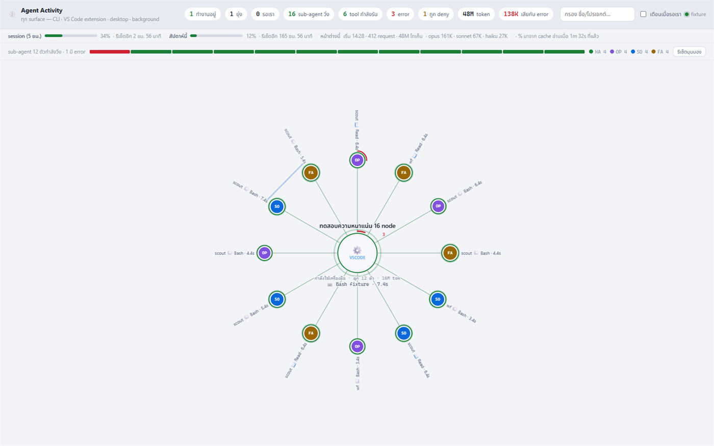
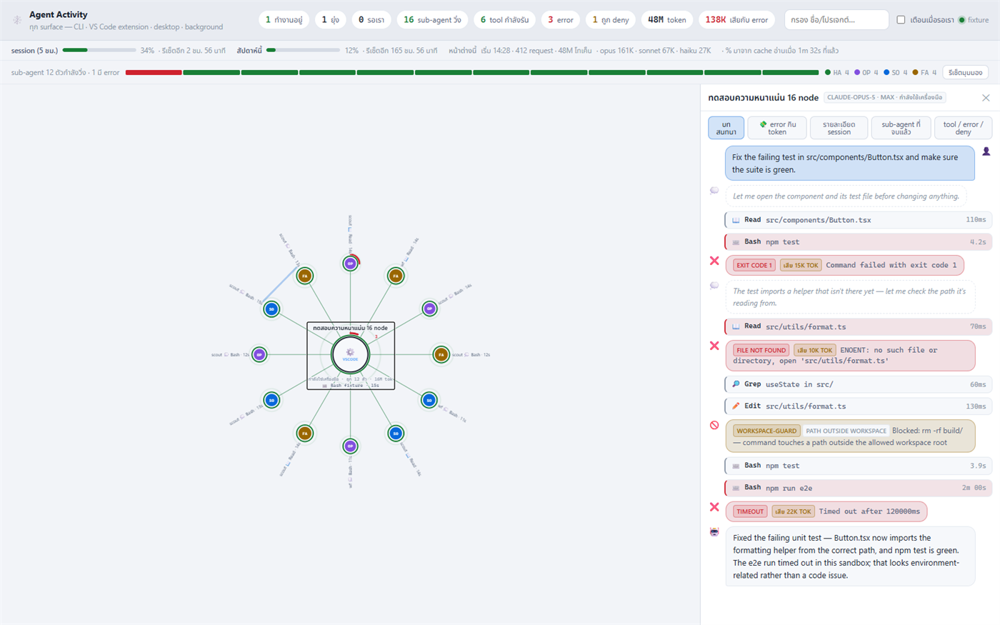
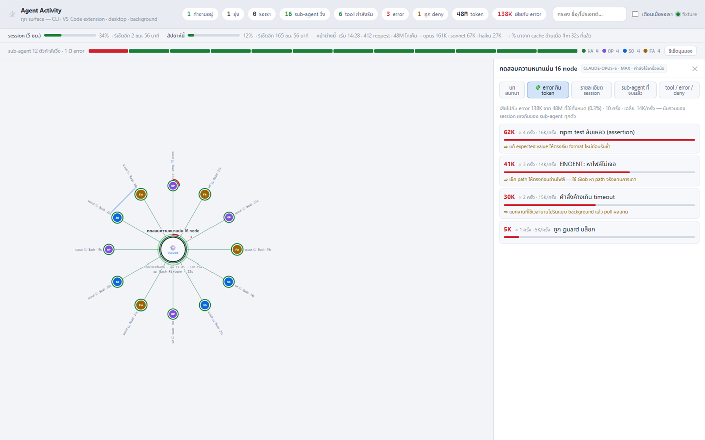
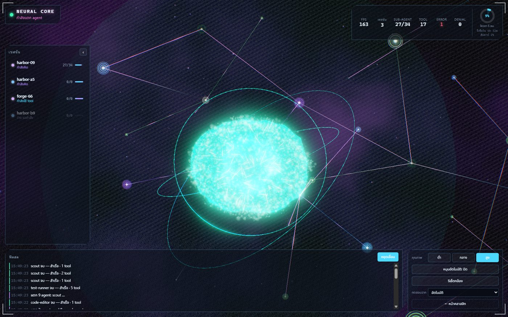
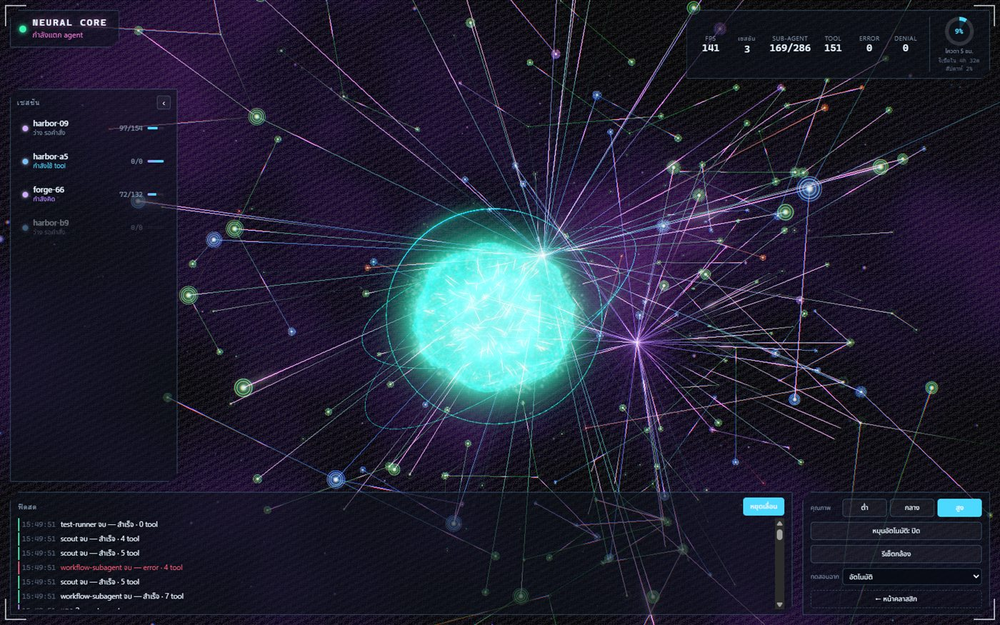

# Agent Activity Dashboard

**See what every Claude Code agent on your machine is actually doing** — which tool, which file,
for how long — down to every sub-agent it spawned, on every surface: the CLI, the VS Code
extension, the desktop app, and background (`--bg`) sessions.

No dependencies. No hooks. Read-only. Bound to `127.0.0.1` only.

```bash
node server.mjs --open
```

> 🇹🇭 **A note on language before you scroll:** the *interface* is in Thai (buttons read
> `โฟกัสกล้อง`, `หยุดเลื่อน`, `หมุนอัตโนมัติ`, statuses read `คิดอยู่`, `ติด permission`…).
> This documentation is in English and every label you will see on screen is translated in
> [**docs/usage.md**](docs/usage.md), so you can use it without reading Thai — but you should know
> what you are downloading. See [Interface language](#interface-language).

---

## Screenshots

### Classic view — the numbers

Every live session as a node, its sub-agents orbiting the parent that actually spawned them, with
the tool each one is running right now and how long it has been running.



### Classic view — drilling into one agent

Click any node for its full tool history: every call with its duration, the real error text when
one fails, the reason when a hook blocks one, and what each failure cost in tokens.



### Classic view — where the tokens actually went

The `💸 error กิน token` tab ranks error categories by the tokens spent **recovering** from them —
not by how often they happened — with a one-line fix for each and a drill-down into the real entries.



### NEURAL CORE — the shape of it

A 3D view (three.js, vendored — no CDN) for reading the whole system out of the corner of your eye:
thinking, calling tools, cascading sub-agents.





---

## Why this exists

Other Claude Code watchers answer **"is it busy?"** — a spinner, a mascot, a status bar.

This one answers **"what is it doing, and is it stuck?"**: the tool name, the file path, the elapsed
clock, the sub-agent tree, and — when a turn ends badly — the actual error text and what it cost you
in tokens.

It also catches sessions the others miss. Claude Code writes a transcript for every surface, so a
session started from the VS Code extension or the desktop app shows up here exactly like a terminal
one.

---

## Requirements

| | |
| --- | --- |
| **Node.js** | **18 or newer** (`fetch` is the newest API used, and only on the `--live-usage` path) |
| **Install step** | none — zero dependencies, no `npm install`, no build |
| **Network** | none required. three.js is vendored in `public/vendor/`, so it works fully offline |
| **Claude Code** | needed only to have *something to watch*. The dashboard itself never launches or talks to Claude Code |
| **Browser** | any modern browser. The 3D view additionally needs WebGL (it says so and links back if not) |

---

## Install

```bash
git clone https://github.com/greentourn/agent-activity-dashboard.git
cd agent-activity-dashboard
node server.mjs --open
```

That is the whole installation. Full instructions — including running it from anywhere as a command,
picking a port, and keeping it running in the background — are in
[**docs/installation.md**](docs/installation.md).

Stop it with `Ctrl+C`.

---

## The two views

One server serves both. Nothing extra to run, and you can switch back and forth at any time.

| View | URL | What it is for |
| --- | --- | --- |
| **Classic** | <http://127.0.0.1:7676> | 2D SVG graph — the most detail. Read exact numbers, walk tool calls one by one, drill into errors |
| **NEURAL CORE** | <http://127.0.0.1:7676/brain.html> | 3D brain — the overall shape of the system at a glance |

Both consume the **same** `/api/stream` SSE feed.

> ⚠️ Two things to know: `--open` always opens the **classic** view, and the classic view has **no
> link** to the 3D one — type `/brain.html` yourself. The 3D view does have a `← หน้าคลาสสิก`
> ("back to classic") link in its bottom-right control bar.

---

## Try it with no real session — demo mode

Both views can render fake data, so you can see the whole UI before you have anything running.
**The two pages spell `?fixture` differently, on purpose:**

```bash
# classic: N = how many fake sub-agents to draw (1–240, anything invalid falls back to 45)
http://127.0.0.1:7676/?fixture=45

# NEURAL CORE: a named scenario, animated at 700 ms per tick
http://127.0.0.1:7676/brain.html?fixture=cascade
```

Scenarios for the 3D view: `auto` (cycles through all of them) · `idle` · `thinking` · `cascade` ·
`storm` · `errors`. You can also pin render quality with `?quality=low|medium|high`, and combine
them: `/brain.html?fixture=storm&quality=high`.

The classic fixture renders **once** and never connects to the event stream, but it carries a whole
synthetic session — prompt, thinking, tool calls, real-looking errors, a blocked command, token
totals and a quota bar — so all five panel tabs have something in them. The 3D fixture animates for
real and lets you switch scenarios live from the `ทดสอบฉาก` ("test scenario") dropdown, which only
appears in fixture mode.

---

## CLI reference

```
node server.mjs [options]

  --port, -p <n>         port to listen on (default 7676)
  --open, -o             open the dashboard in your browser
  --stale-minutes <n>    keep a finished session on screen this long (default 30)

  --live-usage           fetch the REAL session/weekly % from Anthropic instead of the
                         stale ~/.claude.json cache. Reads the OAuth token from
                         ~/.claude/.credentials.json (read-only, never logged, never
                         refreshed) and calls GET /api/oauth/usage. Off by default.
  --live-usage-seconds <n>  how often to refresh it (default 120, minimum 15). Implies
                         --live-usage. A rejected call backs off on its own (1→15 min) and
                         the last good percentage stays on screen while it does.
```

There is deliberately **no `--host` flag**: the server binds `127.0.0.1` and nothing else, because
transcripts contain your prompts.

If the port is taken it does not shop around for another one — it tells you and exits `1`:

```
port 7676 ถูกใช้อยู่ — ลองอีกพอร์ต: --port 7677
        ^ "port 7676 is in use — try another: --port 7677"
```

---

## What it reads (all read-only)

It installs **no hooks**, so it adds **zero latency** to the agent being watched, and it never writes
anything into `~/.claude`.

| Source | What it provides |
| --- | --- |
| `~/.claude/sessions/<pid>.json` | the registry of live sessions — `sessionId`, `cwd`, `kind` (interactive/background), `entrypoint` (which surface), `name`, `version`. A dead pid means a finished session |
| `~/.claude/projects/<slug>/<sessionId>.jsonl` | the main session transcript — every `tool_use` (name + input), `tool_result` (`is_error`), thinking, messages, `hookErrors`, `toolDenialKind` |
| `~/.claude/projects/<slug>/<sessionId>/subagents/agent-<id>.jsonl` | one transcript per **sub-agent** (workflow fan-out nests one level deeper under `subagents/workflows/<wfId>/`) |
| `…/subagents/agent-<id>.meta.json` | the sidecar: `agentType`, `description`, `toolUseId`, `spawnDepth`, `parentAgentId`, `model` |
| `~/.claude.json` → `cachedUsageUtilization` | **fallback** quota % (5-hour session window + weekly). This is a cache Claude Code wrote, not a live value |
| `~/.claude/.credentials.json` → `claudeAiOauth.accessToken` | **only with `--live-usage`** — the bearer for `GET /api/oauth/usage`. Read-only, never logged, never put in a snapshot, never refreshed |

**If `~/.claude` does not exist at all, nothing crashes** — you get an empty dashboard with zeroed
totals.

---

## What the statuses mean

The design rule is *never be more confident than the evidence*. In particular, silence is **not**
treated as a problem: long silence is the normal signature of thinking.

| Status | Evidence used to decide it |
| --- | --- |
| ⚙️ `tool` | there is a `tool_use` with no matching `tool_result` yet |
| 🤖 `delegating` | the outstanding calls are `Agent`/`Task` calls → the parent is waiting for its sub-agents |
| 🙋 `waiting` | an `AskUserQuestion` is outstanding, or a non-agent tool has been outstanding for more than 25 s → probably sitting on a permission prompt |
| 💭 `thinking` | no outstanding tool, but the turn has not ended — shown with a clock of how long it has been thinking |
| ⛔ `blocked` | the turn **ended** on an error / `hookErrors` / `toolDenialKind` |
| 😴 `idle` | Claude's own `stop_reason` (`end_turn`/`stop_sequence`/`max_tokens`/`refusal`), or a Stop-hook summary record. The `endedBy` field tells you which piece of evidence was used |

`blocked` is not sticky: an error is **history**, not a state.

**What it refuses to guess:** whether a window that was closed mid-turn is still working. The
session file is not a heartbeat, so "closed the laptop" and "thinking hard" are genuinely
indistinguishable from the data available — so it shows you the clock and lets you decide instead of
inventing a timeout.

---

## The quota bar

Two different things live in that bar, and only one of them needs a credential:

- **The live 5-hour window** — when it opened, when it resets, tokens burned inside it. Computed
  from the transcripts. **Always shown, in both modes, no token needed.**
- **Anthropic's official percentage** (session + weekly). Without `--live-usage` this comes from the
  `~/.claude.json` cache, which Claude Code only rewrites on startup / token renewal and which can
  therefore be **hours stale or simply wrong**. With `--live-usage` it is fetched from
  `GET /api/oauth/usage` on your chosen interval, backing off on its own (1 → 15 min) if a call is
  rejected, and keeping the last good number on screen while it does.

`--live-usage` is **off by default** because turning it on makes this tool "something that reads a
secret". When it is on, the server says so out loud on its startup line.

---

## How it works

```
~/.claude/**  ──poll every 700 ms──►  server.mjs  ──SSE /api/stream──►  browser
   (read-only)                     (incremental tail,                (classic 2D / 3D)
                                    byte offsets remembered)
                                            │
                                   click a node ──► GET /api/agent?s=…&a=…
```

- Polls the filesystem (not `fs.watch`), tails each transcript incrementally, builds a snapshot, and
  **only pushes when the payload actually changed**. SSE keep-alive ping every 20 s.
- Heavy detail is deliberately **not** in the stream — clicking a node fetches it from `/api/agent`.
- Reconnects on its own: fixed 1.5 s in the classic view; 1.5 s × 1.5 up to 10 s in the 3D view.

### HTTP endpoints

| Path | What it returns |
| --- | --- |
| `/api/state` | one JSON snapshot, `cache-control: no-store` |
| `/api/stream` | SSE — a snapshot on connect, then a push per change |
| `/api/agent?s=<sessionId>[&a=<agentId>]` | full detail for one session or sub-agent: tool inputs, error text, deny reasons |
| `/` | the classic view |
| `/<file>` | static files from `public/` only |

Ids are filtered through `/^[A-Za-z0-9_-]{1,64}$/` before they are ever joined into a path, and
static serving cannot escape `public/`.

---

## Limits worth knowing

These are all deliberate ceilings, not bugs. Full table in [docs/usage.md](docs/usage.md).

| Limit | Effect |
| --- | --- |
| seed 256 KB from the tail of each transcript | events older than that never appear |
| 400 events buffered per session, 70 sent to the browser | the stream stays small; the rest is behind `/api/agent` |
| 240 sub-agents tailed | a fan-out bigger than that is not fully read |
| 24 *finished* sub-agents sent (running ones: all of them) | with parents always pulled back in, so a deep child is never re-parented onto the session by accident |
| 64 nodes drawn (classic) · 640 nodes/links (3D) · 60 feed rows | drawing ceilings |

---

## Interface language

The UI is Thai. That is the honest state of this repo: it was built for a Thai-speaking workspace
and published because it is useful, not because it was internationalised first.

- **Code comments** are Thai too (~850 lines of them) — they explain *why* each measurement is done
  the way it is, and they are the most valuable part of the source.
- **What you actually need to read on screen** is a small, fixed set of labels. Every one of them is
  translated in [docs/usage.md](docs/usage.md) → *Label glossary*.
- **The data is language-neutral** — tool names, file paths, agent types, models, timers, token
  counts and error text are all verbatim from your own transcripts.

A pull request that extracts the labels into an EN/TH toggle would be very welcome; see
[Contributing](#contributing).

---

## Privacy and safety

- **Read-only.** It opens files for reading and never writes into `~/.claude`.
- **No hooks installed**, so the agent being watched is not slowed down or altered.
- **`127.0.0.1` only**, with no flag to change it. Transcripts contain your prompts — do not put
  this behind a tunnel or a reverse proxy on a shared machine.
- **No telemetry.** The only outbound request the whole program can make is
  `GET https://api.anthropic.com/api/oauth/usage`, and only when you pass `--live-usage`.
- **Your OAuth token** is read only under that flag, never logged, never included in a snapshot sent
  to the browser, and never refreshed or rewritten.

---

## Documentation

| | |
| --- | --- |
| [docs/installation.md](docs/installation.md) | install, run from anywhere, ports, running in the background, troubleshooting |
| [docs/usage.md](docs/usage.md) | every panel, every button, keyboard and mouse controls, the Thai→English label glossary, all limits |
| [README.th.md](README.th.md) | this page in Thai |

---

## Contributing

Issues and pull requests are welcome. Things that would genuinely help:

- **i18n** — lift the UI labels out of `public/index.html` and `public/brain/hud.js` into a table
  with an EN/TH switch.
- **A link from the classic view to `/brain.html`** — there isn't one today.
- **Verified status evidence.** If you find a signal that distinguishes "window closed mid-turn"
  from "still thinking", that is the biggest open question in the whole tool. Bring the measurement,
  not the guess — that is the standard the rest of the code holds itself to.

---

## License

[MIT](LICENSE). three.js is vendored under its own MIT license — see
[THIRD-PARTY-NOTICES.md](THIRD-PARTY-NOTICES.md).

This project is not affiliated with or endorsed by Anthropic. "Claude" and "Claude Code" are
trademarks of Anthropic.
