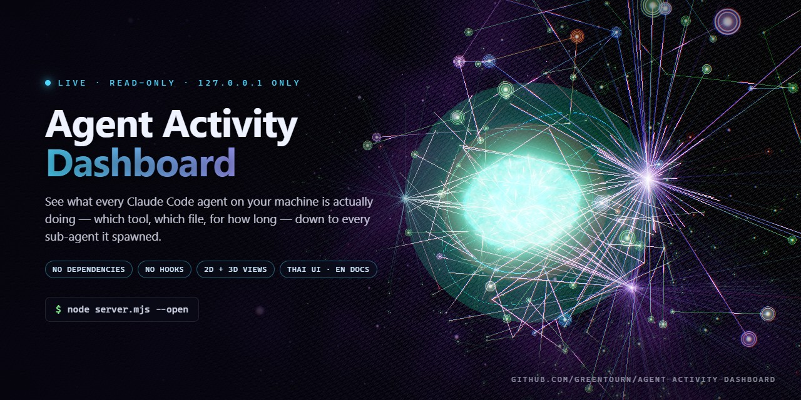

# Agent Activity Dashboard



[English](README.md)

**ดูว่า agent ของ Claude Code ทุกตัวบนเครื่องคุณกำลังทำอะไรอยู่จริง ๆ** — กำลังเรียก tool ไหน ไฟล์ไหน
นานแค่ไหนแล้ว ลงลึกไปถึงทุก sub-agent ที่มันแตกออกไป ครบทุก surface ไม่ว่าจะเป็น CLI ส่วนเสริมของ VS Code
แอปเดสก์ท็อป หรือเซสชันที่รันเป็น background (`--bg`)

ไม่มี dependency ไม่มี hook ทำงานแบบอ่านอย่างเดียว (read-only) ผูกกับ `127.0.0.1` เท่านั้น ทั้งสองหน้า
ใช้ระบบเสียงกิจกรรมข้ามแพลตฟอร์มชุดเดียวกัน: event ใหม่ทุกตัวมีเสียงสัญญาณล้ำอนาคตที่จำแนกเหตุการณ์ได้
ส่วนเหตุการณ์สำคัญมีคำพูดภาษาไทยที่เข้าใจง่ายและภาพ pulse ตามเสียง

```bash
node server.mjs --open --live-usage
```

> 🇹🇭 **หมายเหตุเรื่องภาษา:** หน้าจอของโปรแกรมนี้เป็นภาษาไทยล้วน — ปุ่มต่าง ๆ เขียนว่า `โฟกัสกล้อง`,
> `หยุดเลื่อน`, `หมุนอัตโนมัติ` ส่วนสถานะเขียนว่า `คิดอยู่`, `ติด permission` ฯลฯ เอกสารชุดนี้มีให้อ่านทั้ง
> ภาษาไทย (หน้านี้) และภาษาอังกฤษที่ [README.md](README.md) ส่วนป้ายทุกอันที่ขึ้นบนจอก็มีคำแปลไทย→อังกฤษ
> อยู่ใน [**docs/usage.md**](docs/usage.md) ครบทุกคำ อ่านต่อได้ที่
> [ภาษาที่ใช้ในหน้าจอ](#ภาษาที่ใช้ในหน้าจอ)

---

## ภาพหน้าจอ

### มุมมอง Classic — เห็นเป็นตัวเลข

ทุกเซสชันที่ทำงานอยู่แสดงเป็นโหนดหนึ่งจุด sub-agent ของมันโคจรรอบ parent ตัวจริงที่แตกมันออกมา พร้อมบอกว่า
แต่ละตัวกำลังรัน tool อะไรอยู่ และรันมานานแค่ไหนแล้ว


### มุมมอง Classic — เจาะลึกไปที่ agent ตัวเดียว

คลิกโหนดไหนก็ได้เพื่อดู tool history เต็ม ๆ ของมัน — ทุกครั้งที่เรียกพร้อมเวลาที่ใช้ ข้อความ error จริงเมื่อมันพลาด
เหตุผลตอนที่ hook บล็อก และแต่ละครั้งที่พลาดกินโทเค็นไปเท่าไร


### มุมมอง Classic — โทเค็นหายไปกับอะไร

แท็บ `💸 error กิน token` เรียงหมวดของ error ตาม**โทเค็นที่เสียไปกับการแก้ตัว** ไม่ใช่ตามจำนวนครั้งที่เกิด
พร้อมวิธีแก้บรรทัดเดียวต่อหมวด และกดเจาะลงไปดูรายการจริงได้


### NEURAL CORE — รูปทรงของทั้งระบบ

มุมมอง 3D (ใช้ three.js แบบ vendored ไว้ในเครื่อง ไม่พึ่ง CDN) ไว้กวาดตามองทั้งระบบแบบเร็ว ๆ ด้วยหางตา ว่า
ตอนนี้กำลังคิดอยู่ กำลังเรียก tool อยู่ หรือ sub-agent กำลัง cascade กันอยู่


---

## ทำไมถึงต้องมีตัวนี้

เครื่องมือเฝ้าดู Claude Code ตัวอื่น ๆ ตอบแค่คำถามว่า **"กำลังทำงานอยู่ไหม"** — เป็น spinner หมุน ๆ มาสคอต
ขยับ ๆ หรือแถบสถานะ

ตัวนี้ตอบคำถามว่า **"กำลังทำอะไรอยู่ และมันติดขัดหรือเปล่า"**: ชื่อ tool ที่เรียกใช้ path ของไฟล์ เวลาที่เดิน
ไปแล้ว ต้นไม้ของ sub-agent และ — ถ้า turn จบแบบพัง — ข้อความ error จริง พร้อมบอกว่ามันกิน token ไปเท่าไหร่

มันยังจับเซสชันที่เครื่องมืออื่นมองไม่เห็นได้ด้วย เพราะ Claude Code เขียน transcript ให้ทุก surface เซสชันที่
เปิดจากส่วนเสริม VS Code หรือแอปเดสก์ท็อป จึงโผล่ตรงนี้เหมือนกับเซสชันจาก terminal ทุกประการ

---

## สิ่งที่ต้องมี

| | |
| --- | --- |
| **Node.js** | **18 หรือใหม่กว่า** (`fetch` เป็น API ใหม่สุดที่ใช้ในโปรแกรมนี้ และใช้เฉพาะตอนเปิด `--live-usage` เท่านั้น) |
| **ขั้นตอนติดตั้ง** | ไม่มี — ไม่มี dependency เลยสักตัว ไม่ต้อง `npm install` ไม่ต้อง build |
| **เครือข่าย** | ไม่ต้องต่อเน็ตก็ได้ เพราะ three.js ถูก vendored ไว้ใน `public/vendor/` แล้ว ใช้งานแบบ offline ล้วน ๆ ได้เลย |
| **Claude Code** | ต้องมีก็แค่เพื่อให้มี*อะไรสักอย่างให้เฝ้าดู* ตัว dashboard เองไม่เคยเปิดหรือคุยกับ Claude Code เลย |
| **เบราว์เซอร์** | เบราว์เซอร์สมัยใหม่บน Windows, macOS หรือ Linux เสียงเอฟเฟกต์ใช้ Web Audio ส่วนเสียงพูดเลือก voice `th-*` ที่ติดตั้งอยู่ในเบราว์เซอร์/ระบบปฏิบัติการก่อน ถ้าไม่มีเสียงไทยจะใช้เสียง local ของเครื่อง (มักเป็นอังกฤษ) พูดชุดประโยคภาษาอังกฤษแทน และถ้าไม่มีเสียง local เลยจึงถอยไปใช้เอฟเฟกต์อย่างปลอดภัย มุมมอง 3D ต้องมี WebGL เพิ่มด้วย |

---

## ติดตั้ง

```bash
git clone https://github.com/greentourn/agent-activity-dashboard.git
cd agent-activity-dashboard
node server.mjs --open
```

แค่นี้คือการติดตั้งทั้งหมด รายละเอียดแบบเต็ม — รวมถึงการรันเป็นคำสั่งจากที่ไหนก็ได้ การเลือกพอร์ต และการรัน
ค้างไว้เป็น background — อยู่ที่ [**docs/installation.th.md**](docs/installation.th.md)

หยุดการทำงานด้วย `Ctrl+C`

---

## สองมุมมอง

server ตัวเดียวเสิร์ฟทั้งสองมุมมอง ไม่ต้องรันอะไรเพิ่ม สลับไปมาระหว่างสองมุมมองได้ตลอดเวลา

| มุมมอง | URL | ใช้ทำอะไร |
| --- | --- | --- |
| **Classic** | <http://127.0.0.1:7676> | กราฟ SVG แบบ 2D — เห็นรายละเอียดมากที่สุด อ่านตัวเลขตรง ๆ ไล่ดู tool call ทีละตัว เจาะลึกเข้าไปดู error ได้ |
| **NEURAL CORE** | <http://127.0.0.1:7676/brain.html> | สมอง 3D — เห็นรูปทรงรวมของทั้งระบบได้ในสายตาเดียว |

ทั้งสองมุมมองกิน SSE feed จาก `/api/stream` **ตัวเดียวกัน**

ทั้งสองหน้าใช้ audio engine ในเบราว์เซอร์ชุดเดียวกันและมี 3 โหมด: `ปิด` (ค่าเริ่มต้น), `เอฟเฟกต์`
และ `พูด+เอฟเฟกต์` event ใหม่ทุกตัวมี cue ตามตระกูลเหตุการณ์พร้อมความต่างเล็กน้อย ส่วนเสียงพูดจะใช้เฉพาะ
ตอนเปลี่ยนสถานะสำคัญและสรุป event ที่มารัวเป็นชุด คำพูดภาษาไทยหมุนหลายแบบโดยไม่ซ้ำประโยคเดิมติดกัน
และใช้คำทั่วไปอย่าง `ผู้ช่วย` แทนศัพท์เทคนิคที่คนฟังอาจไม่เข้าใจ

`เตือนซ้ำเมื่อรอฉัน` เป็นตัวเลือกแยกที่ระบบจำไว้ เมื่อเปิด ระบบจะเตือนทันทีที่เริ่มรอ ส่งเอฟเฟกต์ซ้ำเมื่อครบ
ประมาณ 30 วินาที พูดเตือนเมื่อครบประมาณ 90 วินาทีในโหมด `พูด+เอฟเฟกต์` แล้วเตือนทุกประมาณ 120 วินาที
จนกว่าสถานะรอจะหายไป (เบราว์เซอร์อาจหน่วงเวลานี้เมื่อแท็บอยู่เบื้องหลังหรือเครื่องพัก) ถ้ามีหลายงานรอพร้อมกัน
จะรวมเป็นข้อความเดียว ไม่แย่งกันพูด snapshot แรกเป็น baseline แบบเงียบ และ snapshot ซ้ำไม่เล่นเสียงซ้ำ

browser storage เก็บเฉพาะโหมดเสียงกับค่าการเตือนซ้ำ ไม่เก็บข้อมูลกิจกรรมหรือ transcript เอฟเฟกต์ถูกสร้าง
ในเครื่อง และเสียงพูดใช้เฉพาะ voice ที่เบราว์เซอร์/ระบบปฏิบัติการระบุว่าเป็น local เท่านั้น ฟีเจอร์เสียงจึงไม่ส่งข้อความ
หรือข้อมูลกิจกรรมออกทางเครือข่าย ระบบนี้ไม่ได้ผูกกับ Windows—บน macOS และระบบเดสก์ท็อปที่รองรับก็ใช้
เส้นทางเดียวกัน voice ภาษาไทย (บน Windows คือ `Microsoft Premwadee` ติดตั้งผ่าน language pack ไทย
โดยติ๊ก Text-to-speech) จะถูกเลือกก่อนเสมอ ถ้าไม่มี ระบบจะใช้เสียงเริ่มต้นของเครื่องพูดข้อความเดียวกัน
เป็นภาษาอังกฤษแทน และถ้าไม่มี voice local เลย เอฟเฟกต์ยังทำงานต่อได้โดยไม่เกิด error voice แบบ cloud
เช่นชุด "Online (Natural)" ของ Edge จะไม่ถูกใช้

> ⚠️ มีสองเรื่องที่ควรรู้ไว้: `--open` จะเปิด **NEURAL CORE** (มุมมอง 3D) เสมอ และมุมมอง classic เอง
> **ไม่มีลิงก์**ไปหามุมมอง 3D เลย — แต่ server พิมพ์ URL ของทั้งสองมุมมองไว้ใน banner ตอนเริ่มรัน เลือกเปิด
> จากตรงนั้นได้เลย ส่วนมุมมอง 3D มีลิงก์ `← หน้าคลาสสิก` อยู่ที่แถบควบคุมมุมขวาล่างให้ และถ้าเบราว์เซอร์ไม่มี WebGL
> มันจะโชว์ลิงก์เดียวกันนี้ให้เอง

---

## ลองใช้โดยไม่มีเซสชันจริง — demo mode

ทั้งสองมุมมองเรนเดอร์ข้อมูลปลอมได้ ทำให้เห็น UI ทั้งหมดได้ก่อนที่จะมีอะไรรันอยู่จริง **สองหน้านี้ตั้งใจเขียน
`?fixture` ไม่เหมือนกัน:**

```bash
# classic: N = จำนวน sub-agent ปลอมที่จะวาด (1–240 · ค่าที่ใช้ไม่ได้จะถอยไปเป็น 45)
http://127.0.0.1:7676/?fixture=45

# NEURAL CORE: ชื่อฉาก · เคลื่อนไหวจริง tick ทุก 700 ms
http://127.0.0.1:7676/brain.html?fixture=cascade
```

ฉาก (scenario) สำหรับมุมมอง 3D มีให้เลือก: `auto` (วนไปทีละฉากจนครบทุกแบบ) · `idle` · `thinking` ·
`cascade` · `storm` · `errors` ปักคุณภาพการเรนเดอร์เองก็ได้ด้วย `?quality=low|medium|high` และรวมกันได้
เลย เช่น `/brain.html?fixture=storm&quality=high`

fixture ของ classic เรนเดอร์**ครั้งเดียว**แล้วไม่ต่อเข้ากับ event stream เลย แต่มันพาเซสชันจำลองมาครบชุด —
คำสั่งของผู้ใช้ การคิด การเรียก tool error ที่เหมือนของจริง คำสั่งที่ถูกบล็อก ยอดโทเค็น และแถบโควตา — ทำให้
แท็บในแผงทั้ง 5 อันมีของให้ดูจริง ส่วน fixture ของฝั่ง 3D เคลื่อนไหวจริง และสลับฉากสด ๆ ได้จาก dropdown
`ทดสอบฉาก` ซึ่งจะโผล่มาให้เห็นเฉพาะตอนอยู่ใน fixture mode เท่านั้น

---

## CLI reference

```
node server.mjs [options]

  --port, -p <n>         port to listen on (default 7676)
  --open, -o             open NEURAL CORE (the 3D view) in your browser
  --stale-minutes <n>    keep a finished session on screen this long (default 30)

  --live-usage           fetch the REAL session/weekly % from Anthropic instead of the
                         stale ~/.claude.json cache. Reads the OAuth token from
                         ~/.claude/.credentials.json (read-only, never logged, never
                         refreshed) and calls GET /api/oauth/usage. Off by default.
  --live-usage-seconds <n>  how often to refresh it (default 120, minimum 15). Implies
                         --live-usage. A rejected call backs off on its own (1→15 min) and
                         the last good percentage stays on screen while it does.
```

จงใจไม่มี flag `--host` ให้ใช้: server ผูกกับ `127.0.0.1` เท่านั้นไม่มีทางอื่น เพราะ transcript มีพรอมป์ต์
ของคุณอยู่ในนั้น

ถ้าพอร์ตถูกใช้ไปแล้ว โปรแกรมจะไม่เที่ยวหาพอร์ตอื่นให้เอง — มันจะบอกคุณแล้ว exit ด้วยรหัส `1`:

```
port 7676 ถูกใช้อยู่ — ลองอีกพอร์ต: --port 7677
```

---

## สิ่งที่มันอ่าน (read-only ทั้งหมด)

มันไม่ติดตั้ง hook ใด ๆ เลย เพราะงั้นจึงไม่เพิ่ม latency ให้ agent ที่ถูกเฝ้าดูแม้แต่นิดเดียว และไม่เคยเขียน
อะไรลงใน `~/.claude` เลย

| แหล่งข้อมูล | ให้ข้อมูลอะไร |
| --- | --- |
| `~/.claude/sessions/<pid>.json` | ทะเบียนของเซสชันที่ยังทำงานอยู่ — `sessionId`, `cwd`, `kind` (interactive/background), `entrypoint` (มาจาก surface ไหน), `name`, `version` ถ้า pid ตายแล้วแปลว่าเซสชันนั้นจบไปแล้ว |
| `~/.claude/projects/<slug>/<sessionId>.jsonl` | transcript หลักของเซสชัน — ทุก `tool_use` (ชื่อ + input), `tool_result` (`is_error`), thinking, message, `hookErrors`, `toolDenialKind` |
| `~/.claude/projects/<slug>/<sessionId>/subagents/agent-<id>.jsonl` | transcript ของ **sub-agent** แต่ละตัว (ถ้าเป็น workflow ที่ fan-out จะซ้อนลึกลงไปอีกชั้นใต้ `subagents/workflows/<wfId>/`) |
| `…/subagents/agent-<id>.meta.json` | ไฟล์ข้อมูลกำกับ (sidecar): `agentType`, `description`, `toolUseId`, `spawnDepth`, `parentAgentId`, `model` |
| `~/.claude.json` → `cachedUsageUtilization` | เปอร์เซ็นต์โควตาแบบ **fallback** (5-hour session window + รายสัปดาห์) เป็นค่า cache ที่ Claude Code เขียนไว้ ไม่ใช่ค่าสด |
| `~/.claude/.credentials.json` → `claudeAiOauth.accessToken` | **ใช้เฉพาะตอนเปิด `--live-usage`** — เป็น bearer token สำหรับยิง `GET /api/oauth/usage` อ่านอย่างเดียว ไม่เคย log ไม่เคยใส่ใน snapshot ไม่เคย refresh |

**ถ้า `~/.claude` ไม่มีอยู่เลย โปรแกรมก็ไม่พัง** — คุณจะได้ dashboard เปล่า ๆ ที่ตัวเลขเป็นศูนย์หมด

---

## สถานะแต่ละแบบหมายถึงอะไร

หลักการออกแบบคือ *อย่ามั่นใจเกินกว่าหลักฐานที่มี* โดยเฉพาะเรื่องความเงียบ — ความเงียบ**ไม่ถือเป็นปัญหา**
เพราะความเงียบนาน ๆ เป็นลักษณะปกติของการคิด

| สถานะ | หลักฐานที่ใช้ตัดสิน |
| --- | --- |
| ⚙️ `tool` | มี `tool_use` ที่ยังไม่มี `tool_result` มาคู่กัน |
| 🤖 `delegating` | call ที่ค้างอยู่เป็น `Agent`/`Task` → parent กำลังรอผลจาก sub-agent |
| 🙋 `waiting` | มี `AskUserQuestion` ค้างอยู่ หรือ tool ที่ไม่ใช่ agent ค้างเกิน 25 s → น่าจะติดอยู่ที่ permission prompt |
| 💭 `thinking` | ไม่มี tool ค้างอยู่ แต่ turn ยังไม่จบ — ขึ้นนาฬิกาบอกว่าคิดมานานแค่ไหนแล้ว |
| ⛔ `blocked` | turn **จบ**ลงด้วย error / `hookErrors` / `toolDenialKind` |
| 😴 `idle` | มาจาก `stop_reason` ของ Claude เอง (`end_turn`/`stop_sequence`/`max_tokens`/`refusal`) หรือจากบันทึกสรุปของ Stop-hook ฟิลด์ `endedBy` จะบอกว่าใช้หลักฐานตัวไหนตัดสิน |

`blocked` ไม่ใช่สถานะติดค้าง: error เป็นแค่**ประวัติ** ไม่ใช่สถานะปัจจุบัน

**สิ่งที่มันไม่เดาให้:** ว่าหน้าต่างที่ถูกปิดไปกลางคันยังทำงานอยู่หรือเปล่า ไฟล์เซสชันไม่ใช่ heartbeat ดังนั้น
"ปิดโน้ตบุ๊กไปแล้ว" กับ "กำลังคิดหนักอยู่" จึงแยกไม่ออกจริง ๆ จากข้อมูลที่มีอยู่ — มันเลยแค่โชว์นาฬิกาให้คุณ
ตัดสินใจเอง แทนที่จะสร้าง timeout ขึ้นมาเดาเอาเอง

---

## แถบโควตา

ในแถบนั้นมีของสองอย่างที่ไม่เหมือนกันอยู่ และมีแค่อย่างเดียวที่ต้องใช้ credential:

- **หน้าต่าง 5 ชั่วโมงแบบสด** — เปิดเมื่อไหร่ รีเซ็ตเมื่อไหร่ เผา token ไปเท่าไหร่ในช่วงนั้น คำนวณจาก
  transcript โดยตรง **ขึ้นเสมอทั้งสองโหมด ไม่ต้องใช้ token ใด ๆ**
- **เปอร์เซ็นต์ทางการจาก Anthropic** (session + รายสัปดาห์) ถ้าไม่เปิด `--live-usage` ค่านี้จะมาจาก cache ที่
  `~/.claude.json` ซึ่ง Claude Code เขียนทับเฉพาะตอน startup หรือตอน renew token เท่านั้น เพราะงั้นเลย
  **อาจเก่าไปหลายชั่วโมงหรือผิดไปเลยก็ได้** ถ้าเปิด `--live-usage` มันจะดึงจาก `GET /api/oauth/usage` ตามรอบ
  เวลาที่คุณกำหนด ถ้าถูกปฏิเสธก็ backoff ให้เองอัตโนมัติ (1 → 15 นาที) และคงตัวเลขล่าสุดที่ยังดีอยู่ค้างไว้บน
  จอระหว่างนั้น

`--live-usage` **ปิดไว้เป็นค่าเริ่มต้น** เพราะถ้าเปิดขึ้นมา เครื่องมือตัวนี้จะกลายเป็น "อะไรสักอย่างที่อ่าน
secret" ทันที เปิดใช้งานเมื่อไหร่ server จะประกาศให้รู้ตรง ๆ บนบรรทัด startup เลย

---

## มันทำงานยังไง

```
~/.claude/**  ──poll every 700 ms──►  server.mjs  ──SSE /api/stream──►  browser
   (read-only)                     (incremental tail,                (classic 2D / 3D)
                                    byte offsets remembered)
                                            │
                                   click a node ──► GET /api/agent?s=…&a=…
```

- Poll filesystem เอา (ไม่ใช้ `fs.watch`) ไล่อ่าน transcript แต่ละไฟล์แบบ incremental สร้าง snapshot ขึ้นมา
  แล้ว **ส่งออกไปเฉพาะตอนที่ payload เปลี่ยนจริง ๆ** เท่านั้น มี SSE keep-alive ping ทุก 20 s
- รายละเอียดหนัก ๆ จงใจ**ไม่ใส่**ไว้ใน stream — คลิกโหนดถึงจะไปดึงจาก `/api/agent`
- ต่อการเชื่อมต่อใหม่เองอัตโนมัติ: มุมมอง classic ใช้ค่าคงที่ 1.5 s ส่วนมุมมอง 3D ไต่จาก 1.5 s × 1.5 ไปจนถึง
  10 s

### HTTP endpoints

| Path | คืนอะไรกลับมา |
| --- | --- |
| `/api/state` | JSON snapshot หนึ่งชุด พร้อม `cache-control: no-store` |
| `/api/stream` | SSE — ส่ง snapshot ให้ตอนเชื่อมต่อ แล้วค่อย push ทุกครั้งที่มีการเปลี่ยนแปลง |
| `/api/agent?s=<sessionId>[&a=<agentId>]` | รายละเอียดเต็มของเซสชันหรือ sub-agent ตัวเดียว: tool input, ข้อความ error, เหตุผลที่ถูก deny |
| `/` | มุมมอง classic |
| `/<file>` | ไฟล์ static จาก `public/` เท่านั้น |

id ทุกตัวถูกกรองผ่าน regex `/^[A-Za-z0-9_-]{1,64}$/` ก่อนจะถูกเอาไป join เข้ากับ path เสมอ และการเสิร์ฟไฟล์
static ก็หลุดออกจาก `public/` ไปไหนไม่ได้

---

## ข้อจำกัดที่ควรรู้ไว้

ทั้งหมดนี้คือเพดานที่ตั้งใจกำหนดไว้ ไม่ใช่บั๊ก ตารางแบบเต็มอยู่ที่ [docs/usage.th.md](docs/usage.th.md)

| Limit | ผลที่เกิดขึ้น |
| --- | --- |
| seed 256 KB จากท้าย transcript แต่ละไฟล์ | event ที่เก่ากว่านี้จะไม่โผล่มาให้เห็นเลย |
| buffer event ไว้ 400 รายการต่อเซสชัน ส่งให้เบราว์เซอร์ 70 รายการ | stream เลยเบาอยู่เสมอ ส่วนที่เหลือไปอยู่หลัง `/api/agent` |
| tail sub-agent ได้สูงสุด 240 ตัว | fan-out ที่ใหญ่กว่านี้จะอ่านไม่ครบ |
| ส่ง sub-agent ที่ *จบแล้ว* 24 ตัว (ตัวที่ยังรันอยู่ส่งให้หมดทุกตัว) | พร้อมดึง parent กลับเข้ามาด้วยเสมอ ทำให้ child ที่อยู่ลึก ๆ ไม่มีทางถูกเปลี่ยน parent ไปอยู่ใต้เซสชันโดยไม่ได้ตั้งใจ |
| วาดโหนดได้ 64 โหนด (classic) · 640 โหนด/เส้นเชื่อม (3D) · แถว feed 60 แถว | เพดานของการวาด |

---

## ภาษาที่ใช้ในหน้าจอ

หน้าจอของโปรแกรมนี้เป็นภาษาไทยล้วน — สร้างมาให้ทีมที่พูดไทยใช้งานจริงก่อน แล้วค่อยเผยแพร่ต่อเพราะเห็นว่ามี
ประโยชน์ ไม่ได้ทำรองรับหลายภาษาไว้ล่วงหน้า

- **คอมเมนต์ในโค้ดก็เป็นภาษาไทย** เช่นกัน (ประมาณ 850 บรรทัด) อธิบายว่า "ทำไม" การวัดแต่ละจุดถึงทำแบบนั้น —
  เป็นส่วนที่มีค่าที่สุดของซอร์สโค้ด
- **ป้ายที่ต้องอ่านจริงบนจอ** มีอยู่ชุดเดียวตายตัวจำนวนไม่มาก แปลไว้ครบใน [docs/usage.md](docs/usage.md) →
  *Label glossary*
- **ข้อมูลจริงเป็นกลางทางภาษาอยู่แล้ว** — ชื่อ tool, path ไฟล์, agent type, model, เวลา, จำนวน token และ
  ข้อความ error ล้วนมาจาก transcript ของคุณตรง ๆ ทั้งหมด

PR ที่แยกป้ายเหล่านี้ออกมาเป็นสวิตช์ EN/TH เป็นเรื่องที่ยินดีต้อนรับมาก ดู [ร่วมพัฒนา](#ร่วมพัฒนา)

---

## ความเป็นส่วนตัวและความปลอดภัย

- **Read-only** เปิดไฟล์เพื่ออ่านอย่างเดียว ไม่เคยเขียนอะไรลงใน `~/.claude` เลย
- **ไม่ติดตั้ง hook ใด ๆ** ดังนั้น agent ที่ถูกเฝ้าดูจึงไม่ช้าลงหรือถูกเปลี่ยนแปลงพฤติกรรมแต่อย่างใด
- **ผูกกับ `127.0.0.1` เท่านั้น** ไม่มี flag ให้เปลี่ยนค่านี้ transcript มีพรอมป์ต์ของคุณอยู่ในนั้น — อย่าเอาไป
  เปิดผ่าน tunnel หรือ reverse proxy บนเครื่องที่ใช้ร่วมกับคนอื่น
- **ไม่มี telemetry** คำขอออกไปนอกเครื่องอย่างเดียวที่โปรแกรมทั้งตัวทำได้คือ
  `GET https://api.anthropic.com/api/oauth/usage` และทำก็ต่อเมื่อคุณเปิด `--live-usage` เท่านั้น
- **OAuth token ของคุณ** จะถูกอ่านก็ต่อเมื่อเปิด flag นั้นเท่านั้น ไม่เคย log ไม่เคยใส่ไว้ใน snapshot ที่ส่งไป
  ให้เบราว์เซอร์ และไม่เคยถูก refresh หรือเขียนทับ

---

## เอกสารเพิ่มเติม

| | |
| --- | --- |
| [docs/installation.th.md](docs/installation.th.md) | ติดตั้ง รันจากที่ไหนก็ได้ เลือกพอร์ต รันเป็น background การแก้ปัญหาเบื้องต้น |
| [docs/usage.th.md](docs/usage.th.md) | ทุกแผง ทุกปุ่ม ปุ่มลัดคีย์บอร์ดและเมาส์ glossary ไทย→อังกฤษ และ limit ทั้งหมด |
| [README.md](README.md) | หน้านี้ฉบับภาษาอังกฤษ |

---

## ร่วมพัฒนา

ยินดีรับทั้ง issue และ pull request สิ่งที่จะช่วยได้จริง ๆ มีดังนี้:

- **i18n** — ดึงป้าย UI ออกจาก `public/index.html` และ `public/brain/hud.js` มาไว้ในตารางที่มีสวิตช์ EN/TH
- **ลิงก์จากมุมมอง classic ไปหา `/brain.html`** — ตอนนี้ยังไม่มี
- **หลักฐานยืนยันสถานะที่แม่นกว่านี้** ถ้าใครเจอสัญญาณที่แยกระหว่าง "หน้าต่างถูกปิดกลางคัน" กับ "ยังคิดอยู่" ได้
  นั่นคือคำถามค้างคาที่ใหญ่ที่สุดของทั้งเครื่องมือนี้เลย เอาการวัดจริงมาให้ ไม่ใช่การเดา — เพราะนั่นคือมาตรฐาน
  ที่โค้ดส่วนที่เหลือทั้งหมดยึดถือกับตัวเอง

---

## ลิขสิทธิ์

[MIT](LICENSE) — three.js ที่ vendored มาด้วยก็อยู่ภายใต้ MIT license ของตัวเอง ดูรายละเอียดที่
[THIRD-PARTY-NOTICES.md](THIRD-PARTY-NOTICES.md)

โปรเจกต์นี้ไม่ได้เป็นส่วนหนึ่งของหรือได้รับการรับรองจาก Anthropic "Claude" และ "Claude Code" เป็นเครื่องหมาย
การค้าของ Anthropic
